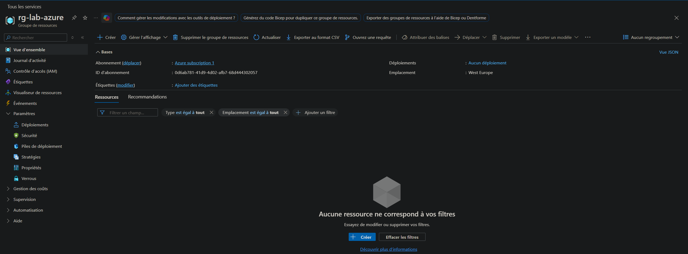
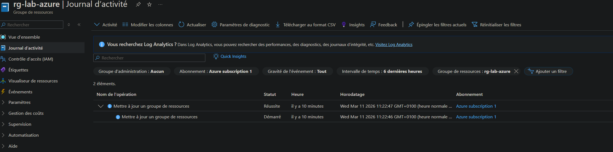
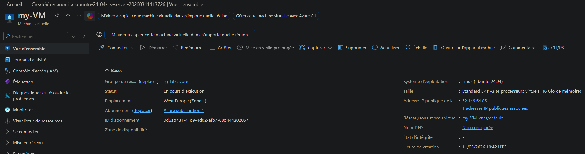
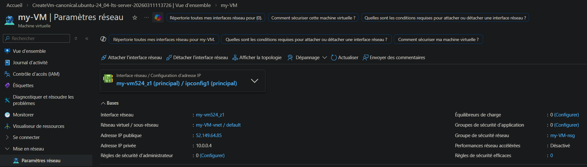

# Jour 1 — Concepts cloud et découverte Azure

## Définitions simples

**Cloud computing**  
Le cloud permet d’utiliser des ressources informatiques via Internet sans gérer directement l’infrastructure physique.

**IaaS**  
Le fournisseur cloud gère l’infrastructure. Le client gère le système d’exploitation et les applications.

**PaaS**  
Le fournisseur gère l’infrastructure et le système. Le client gère surtout les applications.

**SaaS**  
Le fournisseur gère presque tout. L’utilisateur utilise simplement le service.

---

## Modèles cloud

| Modèle | Avantage | Inconvénient |
|---|---|---|
| Public | Flexible et économique | Moins de contrôle |
| Privé | Contrôle total | Plus coûteux |
| Hybride | Flexible | Plus complexe |

---

## Resource Group — Ce que j’ai compris

Un Resource Group est un conteneur logique permettant de regrouper et gérer plusieurs ressources Azure ensemble.

---

## VM Azure — Ce que j’ai compris

Une VM Azure repose sur :

- le calcul (CPU/RAM)  
- le réseau (IP, subnet, NSG)  
- le stockage (disques)

Le NSG agit comme un firewall réseau pour filtrer le trafic.

---

## Ce que j’ai retenu aujourd’hui

- Azure organise les ressources via les Resource Groups  
- le réseau est essentiel dans le cloud  
- la sécurité passe par le contrôle du trafic  

---

## Captures

### Resource Group — Overview

### Resource Group — Activity Log

### VM — Overview

### VM — Networking

