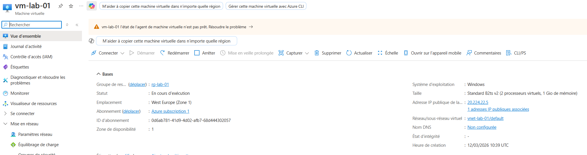
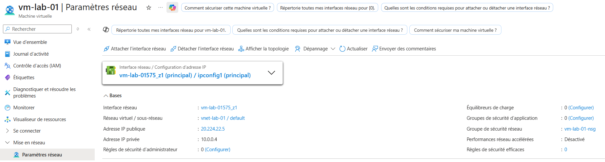
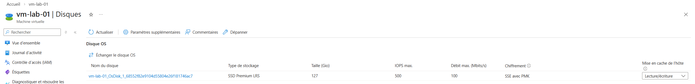

# Jour 2 — Création VM Azure

## Objectif
Créer une VM Azure et comprendre sa structure.

## Ce que j’ai compris
Une VM dépend de plusieurs ressources :

- réseau (VNet, IP, NSG)
- stockage (disque OS)
- compute (CPU/RAM)

## Ce que j’ai retenu
Une VM Azure n’est pas seule, elle dépend du réseau et du stockage.

## Captures

### Overview

### Networking

### Disks

