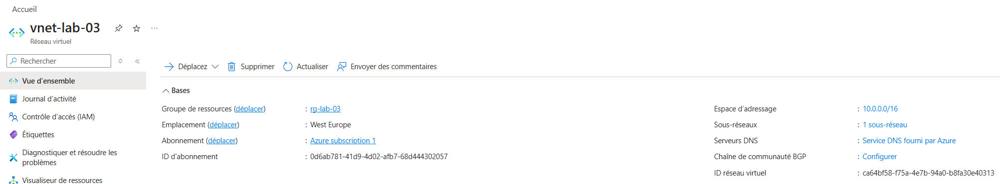
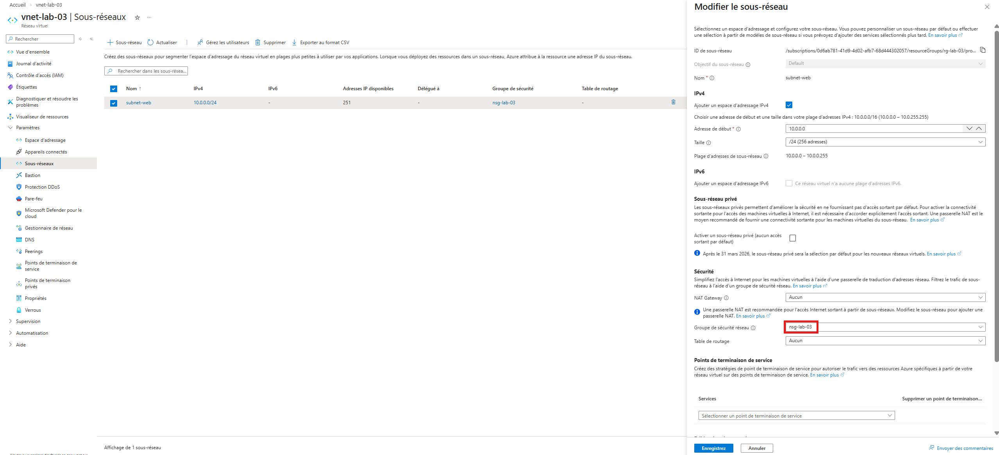
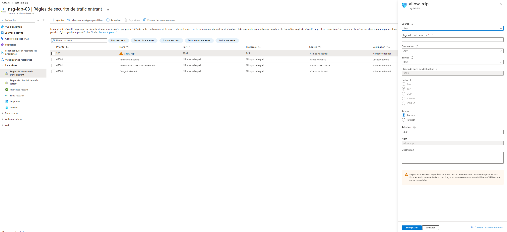

# Jour 3 — Réseau Azure

## Objectif
Comprendre le réseau Azure : VNet, Subnet et NSG.

## Ce que j’ai compris

- VNet = réseau privé Azure
- Subnet = segmentation du réseau
- NSG = firewall Azure
- Les règles contrôlent le trafic entrant/sortant

## Ce que j’ai retenu

Le NSG doit être associé au subnet pour être actif.

## Captures

### VNet Overview

### Subnet

### NSG Rules

