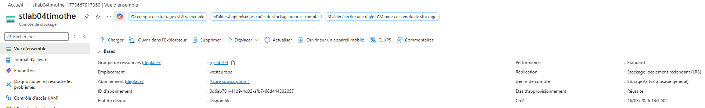
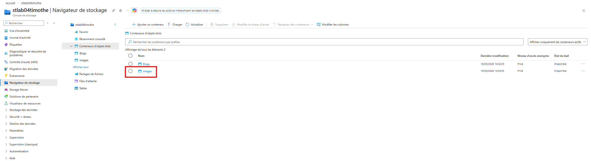
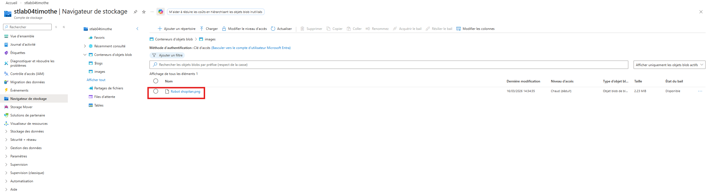

# Jour 4 — Stockage Azure

## Objectif
Comprendre le stockage Azure avec Blob Storage.

## Ce que j’ai appris

Le stockage Azure fonctionne avec une structure :

Storage Account → Container → Blob

- Storage Account : ressource principale de stockage
- Container : dossier logique
- Blob : fichier stocké dans Azure

## Ce que j’ai compris

Les blobs permettent de stocker des fichiers accessibles par les applications, sauvegardes ou services cloud.

## Captures

### Storage Account

### Container

### Blob

