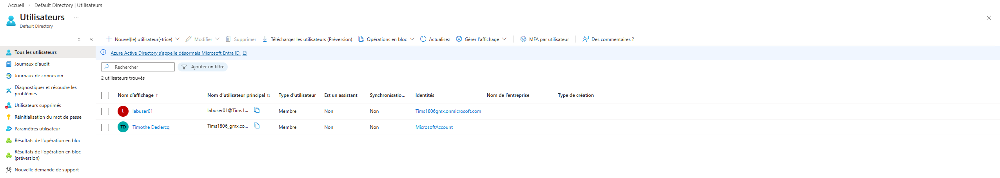
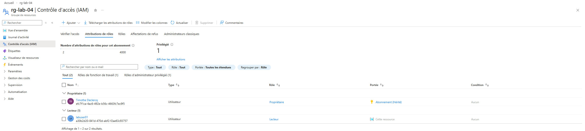
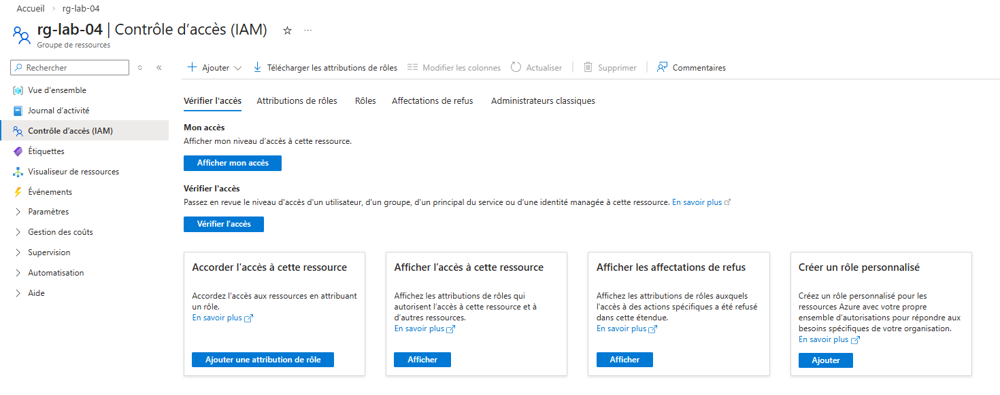

# Jour 5 — Azure IAM / RBAC

## Objectif
Comprendre la gestion des accès dans Azure avec RBAC.

## Ce que j’ai appris

Azure utilise RBAC (Role Based Access Control) pour gérer les permissions.

Structure :

Utilisateur → Rôle → Scope

Exemple :

labuser01 possède le rôle Reader sur le Resource Group rg-lab-04.

Cela lui permet de voir les ressources mais pas de les modifier.

## Captures

### Utilisateur

### Attribution du rôle

### Page IAM

