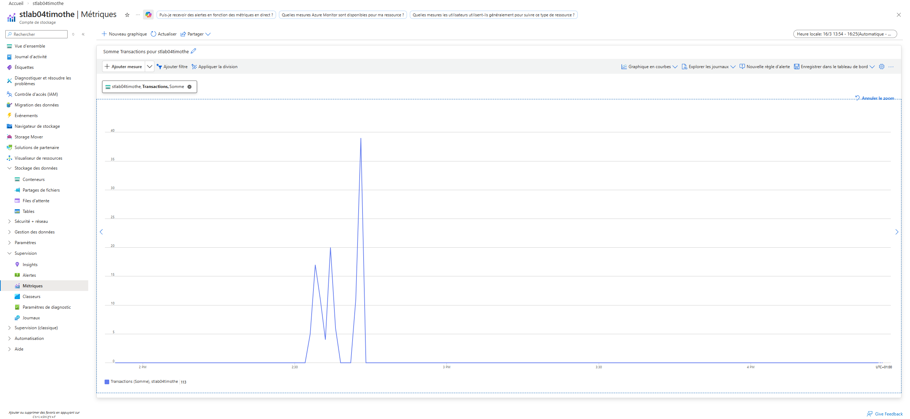
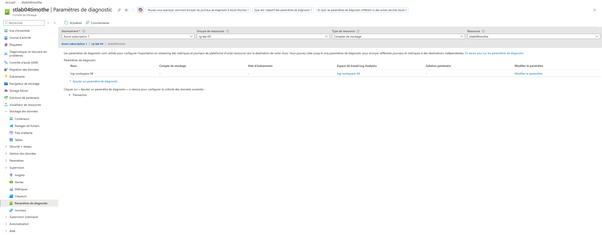
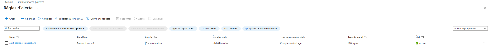

# Jour 6 — Monitoring Azure

## Objectif
Comprendre les bases du monitoring Azure.

## Ce que j’ai appris

Azure Monitor repose sur :
- Metrics
- Logs
- Alerts

Les métriques sont en temps réel.
Les journaux demandent une configuration de diagnostic et un workspace.
Les alertes permettent de détecter automatiquement une activité.

## Captures

### Metrics

### Diagnostic settings

### Alert rule

