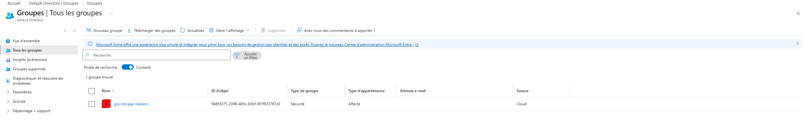
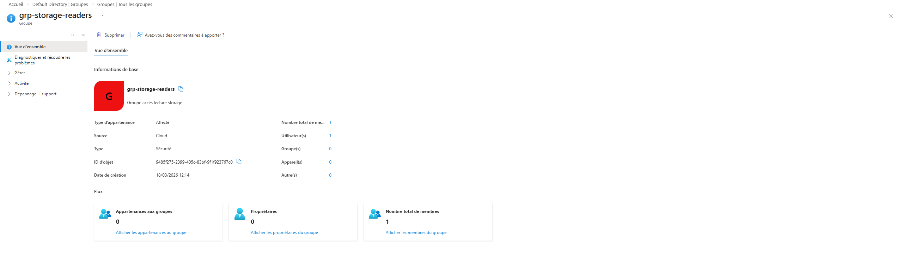
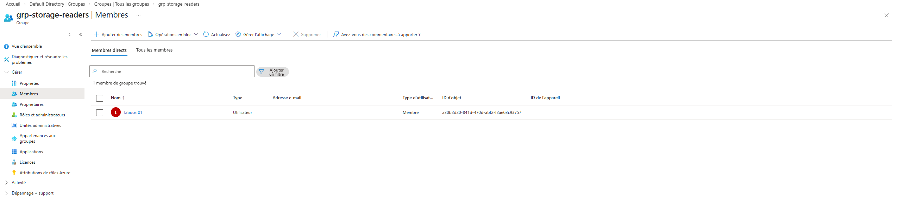
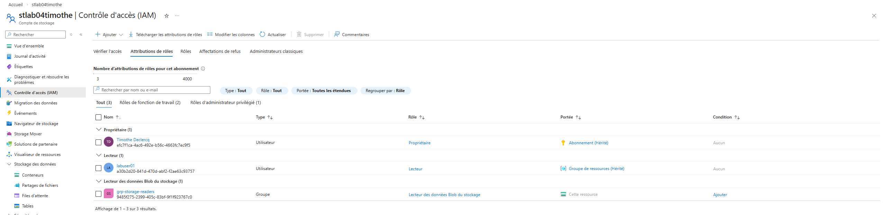

# 📘 Jour 7 — Gestion des accès avec groupes (RBAC)

## 🎯 Objectif
Mettre en place une gestion des accès via des groupes plutôt que des utilisateurs individuels.

---

## 🧱 Étapes réalisées

### 👥 Création d’un groupe
- Nom : **grp-storage-readers**
- Type : **Sécurité**

📸 Capture :

---

### 🧾 Vue d’ensemble du groupe
Cette vue permet de vérifier les informations générales du groupe et le nombre de membres.

📸 Capture :

---

### ➕ Ajout d’un utilisateur au groupe
- Utilisateur ajouté : **labuser01**

📸 Capture :

---

### 🔐 Attribution d’un rôle au groupe
- Ressource : **stlab04timothe**
- Rôle : **Lecteur des données Blob du stockage**

📸 Capture :

---

## ✅ Résultat
Le groupe dispose d’un accès en lecture au stockage, et tous les membres du groupe héritent automatiquement de ces permissions.

---

## 🧠 Bonnes pratiques retenues
- Utiliser des **groupes** pour gérer les accès
- Éviter les attributions directes aux utilisateurs
- Centraliser la gestion des permissions
- Rendre l’administration plus simple et plus scalable

---

## 🚀 Conclusion
Cette approche correspond aux standards utilisés en entreprise pour gérer les accès Azure de manière propre, sécurisée et évolutive.
